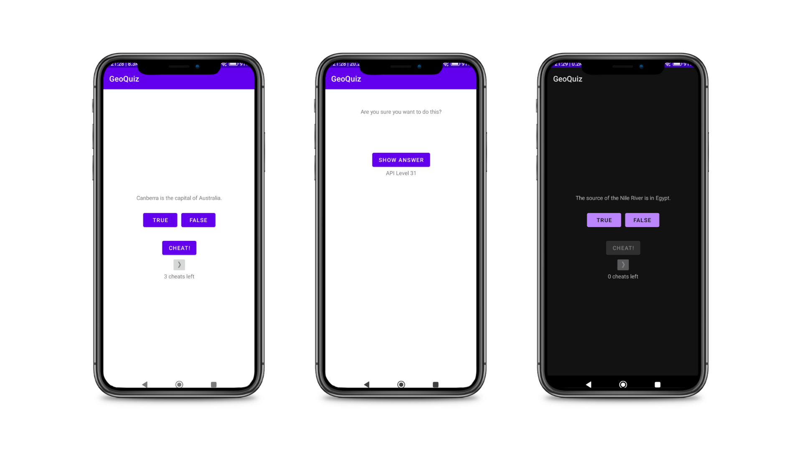

# Quiz - Android

This project is a non-functional Android application developed using Kotlin, primarily designed as a learning platform to apply knowledge acquired from my own. It is not intended for end users, but rather for developers who wish to explore and understand various Android concepts and best practices.

## Key Concepts and Technologies

The following concepts and technologies are demonstrated and applied in this project:

- AndroidX and Architecture Components
- Communication between Activities
- Optimized layouts for Android devices
- Good Android practices
- Android SDK version and compatibility
- Model-View-Controller (MVC) pattern
- Screen pixel densities
- Saving data in Android cache
- Android processes
- Android Exceptions
- Stack Traces
- Lint

## Application User Interface

## Getting Started

To get started with this project, follow these steps:

1. Clone the repository:  
`git clone https://gitlab.com/mateoscarlos/quiz-android.git`

2. Open the project using [Android Studio](https://developer.android.com/studio).

3. Run the application on an Android emulator or a physical device connected to your computer.

## Contributing

If you'd like to contribute to this project, please follow these steps:

1. Fork the repository.
2. Create a new branch for your feature or bugfix.
3. Commit your changes.
4. Open a pull request to merge your changes back into the main branch.

## Acknowledgements

- Thanks to [The Big Nerd Ranch](https://www.bignerdranch.com/) for creating the "Android Programming: The Big Nerd Ranch Guide" book that inspired this project.

